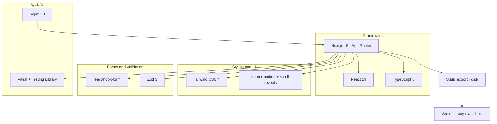

# Tuju Outspan Cyber Center Website

Your Hustle. Our Tech. Made Easy.

Official website for Tuju Outspan Cyber Center, a full-service cyber and digital
solutions provider based at Ikonge-Ekerenyo Stage, Chuka University, with online
services available countrywide. The site is a WhatsApp-first storefront: every
page guides visitors toward a pre-filled WhatsApp chat, backed by clean,
conversion-focused design and fast static hosting.

## Features

- 15 pages: home, about, services hub, 8 service categories, pricing, contact, blog, blog post
- WhatsApp-first CTAs with pre-filled messages and a floating chat button
- Searchable services directory and a quick inquiry form that opens WhatsApp
- Static export with SEO metadata, Open Graph, and JSON-LD structured data
- Accessible: semantic markup, skip link, focus rings, keyboard-friendly menus and FAQs
- Tested with Vitest and Testing Library

## Tech Stack


The site is a static Next.js application. Next.js 15 App Router builds every page
at deploy time into plain HTML, CSS, and JavaScript, so the result runs on any
static host with no server required. TypeScript keeps the codebase type-safe,
Tailwind CSS 4 provides the design-system tokens, and small client components
handle the only interactive parts: the mobile menu, search, form validation,
FAQ accordions, blog filters, and scroll reveals.



| Layer           | Technology                     | Purpose                           |
| --------------- | ------------------------------ | --------------------------------- |
| Framework       | Next.js 15 (App Router)        | Pages, routing, static export     |
| Language        | TypeScript 5                   | Type-safe application code        |
| UI              | React 19 + Tailwind CSS 4      | Components and design system      |
| Animation       | framer-motion + custom reveals | Mobile menu and scroll animations |
| Forms           | react-hook-form + Zod          | Contact form validation           |
| Testing         | Vitest + Testing Library       | Unit and component tests          |
| Package manager | pnpm 10                        | Dependencies and scripts          |
| Hosting         | Vercel or any static host      | `dist/` static output             |

## Project Structure

A trimmed view of the repository; the full map lives in
[`docs/project-structure.md`](docs/project-structure.md).

```text
tuju-outspan-website/
├── app/                  # Next.js App Router: pages, components, data, utils
│   ├── components/       # layout, sections, templates, ui
│   ├── lib/              # data, schemas, utils (SEO, WhatsApp, dates)
│   ├── services/         # services hub + 7 category pages
│   └── ...
├── docs/                 # design and architecture documentation
├── __tests__/            # Vitest + Testing Library suites
├── public/               # static assets: images, icons, og image
├── scripts/              # postbuild sitemap generator
├── .env.example          # environment variable template
└── package.json
```

## Getting Started

### Prerequisites

- Node.js 22 or newer
- pnpm 10 or newer (`npm install -g pnpm` or enable Corepack)

### Clone or Extract

Clone the repository:

```bash
git clone <repository-url> tuju-outspan
cd tuju-outspan
```

Or download the project as a ZIP file, extract it, and open the extracted folder
in a terminal.

### Install Dependencies

```bash
pnpm install
```

### Configure Environment Variables

Copy the template and edit the values:

```bash
cp .env.example .env.local
```

| Variable                        | Purpose                                           | Required    |
| ------------------------------- | ------------------------------------------------- | ----------- |
| `NEXT_PUBLIC_WHATSAPP_NUMBER`   | Business WhatsApp number with country code        | Yes         |
| `NEXT_PUBLIC_BUSINESS_EMAIL`    | Contact email used in the footer and contact page | Yes         |
| `NEXT_PUBLIC_BUSINESS_LOCATION` | Shop location shown across the site               | Yes         |
| `NEXT_PUBLIC_SITE_URL`          | Canonical site URL for SEO and the sitemap        | Yes         |
| `NEXT_PUBLIC_MAPS_EMBED_URL`    | Google Maps embed URL for the contact page        | Optional    |
| `NEXT_PUBLIC_WHATSAPP_GROUP`    | WhatsApp group invite link                        | Placeholder |
| `NEXT_PUBLIC_WHATSAPP_CHANNEL`  | WhatsApp channel link                             | Placeholder |

`.env.local` is gitignored and never committed.

### Run the Development Server

```bash
pnpm dev
```

Open [http://localhost:3000](http://localhost:3000).

## Scripts

| Script       | Command             | What it does                                          |
| ------------ | ------------------- | ----------------------------------------------------- |
| dev          | `pnpm dev`          | Start the development server with Turbopack           |
| build        | `pnpm build`        | Static export to `dist/`, then generate `sitemap.xml` |
| preview      | `pnpm preview`      | Serve the built `dist/` locally via `npx serve`       |
| test:ci      | `pnpm test:ci`      | Run the full Vitest suite once                        |
| type-check   | `pnpm type-check`   | Run TypeScript without emitting                       |
| lint         | `pnpm lint`         | Run ESLint                                            |
| format:check | `pnpm format:check` | Verify Prettier formatting                            |

## Build and Deploy

```bash
pnpm build
```

The build writes a fully static site to `dist/` and runs the sitemap generator.
Deploy the `dist/` folder to Vercel, Netlify, GitHub Pages, or any static host.
The export uses trailing slashes on routes and unoptimized images, so assets
should be optimized before being added to `public/`.

Because the site is a static export, there are no API routes and no server-side
features. WhatsApp, the contact form, blog filters, and the mobile menu all run
client-side.

To deploy on Vercel with the correct import settings, environment variables,
and route validation, follow the [Vercel deployment guide](docs/vercel-deployment.md).

## Documentation

The documentation set lives in [`docs/`](docs/), with
[`architecture.md`](docs/architecture.md) as the index.

| Document                                                    | Purpose                                       |
| ----------------------------------------------------------- | --------------------------------------------- |
| [architecture.md](docs/architecture.md)                     | Index, decisions, data model, route map       |
| [Tuju_Outspan_PRD.md](docs/Tuju_Outspan_PRD.md)             | Product requirements and page content         |
| [design.md](docs/design.md)                                 | Design system, spacing, motion, accessibility |
| [color-palette.md](docs/color-palette.md)                   | Brand colors and usage rules                  |
| [tech-stack.md](docs/tech-stack.md)                         | Versions, configuration, commands             |
| [project-structure.md](docs/project-structure.md)           | Canonical file tree and responsibilities      |
| [image-assets.md](docs/image-assets.md)                     | Image inventory, dimensions, formats          |
| [deliverables-checklist.md](docs/deliverables-checklist.md) | Open items and launch checklist               |
| [vercel-deployment.md](docs/vercel-deployment.md)           | Import settings, env vars, validation         |

## License

UNLICENSED. All rights reserved.
